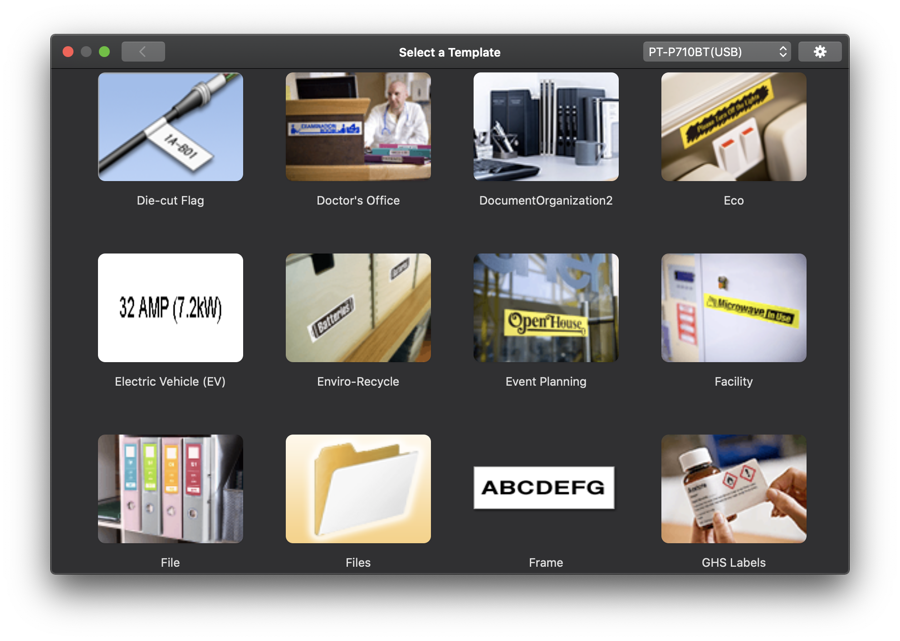

# Brother Mobile Cable Label Downloader

Brother offers a [Mobile Cable Label Tool](https://www.brother.co.uk/business-solutions/brother-mobile-and-cloud/cable-label-tool-app) app for designing telecom, datacom and/or electrical identifications.

The app is compatible with a number of professional and industrial-grade printers<sup>1</sup>, but has stopped receiving updates circa 2017.

These industrial printers also feature WiFi connectivity which is a baseline requirement for the app to work. However, most connected consumer-grade printers — like the [Brother PT-P710BT Cube](https://www.brother.co.uk/labelling-and-receipts/ptouch-cube-plus) — only feature Bluetooth or USB connectivity.

As an alternative, Brother offers a consumer app called _Brother iPrint&Label_, for ([iOS](https://apps.apple.com/us/app/brother-iprint-label/id523047493) and [Android](https://play.google.com/store/apps/details?id=com.brother.ptouch.iprintandlabel&hl=en&gl=US)) and _Brother P-touch Editor_ for [macOS](https://apps.apple.com/us/app/brother-p-touch-editor/id1453365242?mt=12), both offering a much more limited catalog of labels to use.

Since the label format is compatible between both applications, there should be no reason for not importing the industrial labels into the consumer app. After all, who doesn't have extensive IoT projects at home that need professionally-looking labelling?

## Installation

_This project has been tested with the macOS version of the Brother P-touch Editor application. It will most likely work on the Windows equivalent._

Clone this repository and run `yarn` (or `npm install`) to install its dependencies.

```shell
❯ git clone https://github.com/ruimarinho/brother-cable-label-downloader
❯ cd brother-cable-label-downloader
❯ yarn
```

## Usage

Execute `index.js` and wait for the script to download the labels:

```shell
❯ node index.js
```

This will attempt to download the labels into the application's directory, if it is installed and accessible. Otherwise, it will download them into a local folder (`Template/en/Label`). You will then need to copy them into `/Applications/P-touch\ Editor.app/Contents/Resources/Template/en/Label` by running:


```shell
❯ cp -r Template/en/Label /Applications/Brother\ P-touch Editor.app/Contents/Resources/Template/en/Label
```

Once you re-open the `Brother P-Touch Editor` app, you will be presented with a vast collection of new labels:



## License

MIT

## Footnotes

<sup>[1]</sup> _As of November 1st, 2020, the compatibles models are PT-E550W, PT-P750W, PT-D800W, PT-E800W, PT-E850TKW, PT-P900W and the PT-P950NW_.
